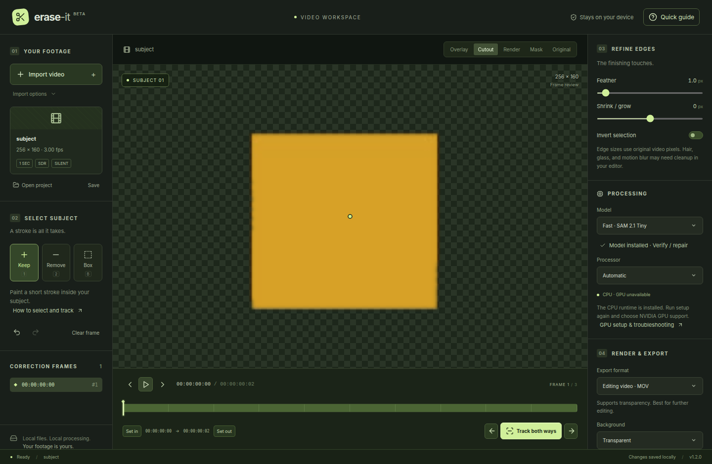
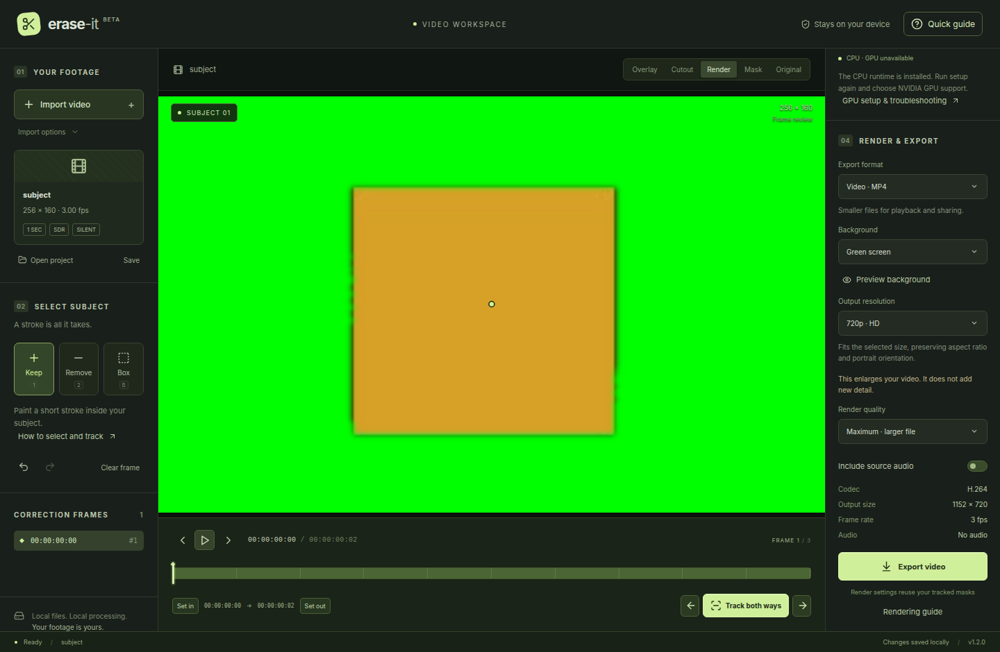

# erase-it

**Make a video subject into a transparent cutout, entirely on your Windows PC.**
Import a clip, mark the subject, track it through the shot, correct any drift, and
export it for your editor. No account, cloud processing, telemetry, usage fees, or
watermark.

[Download for Windows](https://github.com/AmreetKumarkhuntia/earse-it/releases/latest) ·
[First cutout guide](docs/quick-start.md) ·
[Build from source](#develop-locally)

## Demos

These screenshots come from the [real CPU worker integration test](e2e/editor.spec.ts)
using a one-second, three-frame synthetic clip. The orange subject is deliberately
simple so the selection and output settings are easy to see; it is not a claim
about results on complex footage. Click an image to see the full interface.

| Transparent cutout | Green-screen preview |
| --- | --- |
| [](docs/assets/demo-cutout.png) | [](docs/assets/demo-green-screen.png) |
| **Cutout** shows the tracked mask over transparency. Export as ProRes 4444 MOV or RGBA PNG frames to keep alpha. | **Preview background** shows the composited result before an H.264 MP4 export. |

### Try it with your own clip

1. **Import** a short, continuous SDR video and pause on a clear frame. Download
   the Tiny model in **Processing** if prompted.
2. Choose **Keep (1)** and click or draw a short stroke inside the subject. Use
   **Remove (2)** for included background, or **Box (B)** to select by rectangle.
3. Click **Track both ways**. Review the **Cutout** view. If the mask drifts, add a
   Keep or Remove mark on that frame and track again.
4. Set the in/out range and adjust **Feather** or **Shrink / grow**. Every frame
   in the range needs a mask before export is enabled.
5. Under **Render & Export**, choose a format, background, and size. For a
   transparent result in DaVinci Resolve, place the MOV above your background and
   set **Clip Attributes → Alpha Mode → Straight** if Resolve interprets it differently.

The in-app **Quick guide** and [Windows quick start](docs/quick-start.md) explain
selection, rendering, and GPU setup in more detail.

## Install on Windows

Download `erase-it-VERSION-windows-x64-setup.exe` from
[GitHub Releases](https://github.com/AmreetKumarkhuntia/earse-it/releases/latest)
and run it. The installer is unsigned and bundles Python and FFmpeg. It may
fetch WebView2 if Windows does not already have it. Each release includes
`SHA256SUMS` and third-party source and notice files.

The installer works on CPU by default. On first use, download **SAM 2.1 Tiny**
(156 MB) in **Processing**; **Base+** (324 MB) is optional. Model downloads are
verified and resumable. After setup and model download, processing works offline.

For NVIDIA acceleration, choose **Yes** when setup offers it. Setup downloads the
matching CUDA runtime (about 3.2 GB); allow about 12 GB of free space during
installation and 5 GB afterward. A compatible NVIDIA GPU and driver are required.
Only selection and tracking use the GPU; import, decoding, and export use the CPU.
Rerun the same setup EXE to add NVIDIA support later or when updating the app.
AMD and Intel GPU acceleration is not available yet. See
[GPU setup and troubleshooting](docs/quick-start.md#install-nvidia-support).

Before an automated release is available, download the `erase-it-windows-x64`
artifact from a successful **Verify and build Windows app** workflow run.

## What you can export

| Output | When to use it |
| --- | --- |
| ProRes 4444 MOV | Transparent video for an editor, or video over a solid background; optional PCM audio. |
| H.264 MP4 | Smaller, widely playable video over green, blue, black, white, or a custom color; optional AAC audio. MP4 cannot contain transparency. |
| PNG image sequence | Lossless transparent or color frames with `timing.json` frame-rate metadata. |
| 16-bit PNG mask sequence | Grayscale masks for compositing, with `timing.json`. |

**Native** output keeps the displayed source dimensions. Other presets fit the
whole image within 720p, 1080p, QHD/1440p, DCI 2K, or UHD/4K bounds, preserving
aspect ratio and portrait orientation. The panel shows the exact output size.
Upscaling does not add detail. Video quality and source audio are selectable;
image sequences have no audio. You can render more versions from the same masks
without tracking again. Exports never overwrite an existing destination.

The app also has overlay, original-video, grayscale mask, checkerboard cutout,
and rendered-background previews. Original plays the proxy with audio; masked
playback reviews frames one at a time and may be slower than real time.

## Scope and project files

Erase-it selects **one subject per project** using positive/negative strokes or a
box, then tracks it forward and backward. You can add correction frames, undo
selections, cancel processing, invert a mask, and adjust edges in source pixels.
It is practical object segmentation; fine hair, glass, motion blur, and heavy
occlusion may need cleanup in an editor. HDR and interlaced footage require
conversion to SDR progressive video before import.

Project snapshots are saved automatically. A `.cutout` file references the
original video rather than embedding it, so keep that video in place. Changed
source files are rejected to avoid misaligned masks. Processing uses small
preview frames, a bounded cache, and disk-spilled tracking state to limit memory
use. Logs and project data remain local.

## Develop locally

Use **Windows x64, Node 24.15+, Python 3.12, stable Rust with the MSVC toolchain,
Microsoft C++ Build Tools, and WebView2**. No WSL or CUDA compiler is required.

```powershell
git clone git@github.com:AmreetKumarkhuntia/earse-it.git
cd earse-it
npm ci
py -3.12 scripts/setup-worker.py
py -3.12 scripts/prepare-media.py
$env:ERASE_IT_FFMPEG = "$pwd\src-tauri\resources\media\ffmpeg.exe"
$env:ERASE_IT_FFPROBE = "$pwd\src-tauri\resources\media\ffprobe.exe"
npm run desktop:dev
```

`npm run dev` previews the interface in a browser; processing and native file
dialogs need the desktop host. For GPU development, run
`py -3.12 scripts/setup-worker.py --device cuda` and set `ERASE_IT_PYTHON` to the
absolute path of `.venv-cuda\Scripts\python.exe`.

```powershell
npm test
npm run build
.venv/Scripts/python -m pytest worker/tests -m "not inference" -q
.venv/Scripts/python -m erase_it --data-dir .cache/inference --download-model tiny
$env:ERASE_IT_TEST_MODELS = "$pwd\.cache\inference"
.venv/Scripts/python -m pytest worker/tests -m inference -q
```

To build an installer, run `py -3.12 scripts/prepare-media.py` first, then:

```powershell
.venv/Scripts/python scripts/package-worker.py
.venv/Scripts/python scripts/check-frozen-worker.py
npm run desktop:build
```

The NSIS installer lands under `src-tauri/target/release/bundle/nsis/`.
Redistributed installers must include the companion source and notice artifact.
The Python worker and frontend can also be developed and tested on Linux with
system FFmpeg; Linux desktop distribution is deferred.

See [contributing](CONTRIBUTING.md) for commit rules,
[release automation](docs/releases.md) for publishing details,
[architecture](docs/architecture.md) for the project layout, and
[validation](docs/validation.md) for test coverage and remaining checks.

## License

Original code: [Apache-2.0](LICENSE). Models and libraries retain their own
licenses; see [third-party notices](licenses/THIRD_PARTY.md). The optional CUDA
pack uses NVIDIA runtime redistribution terms.
